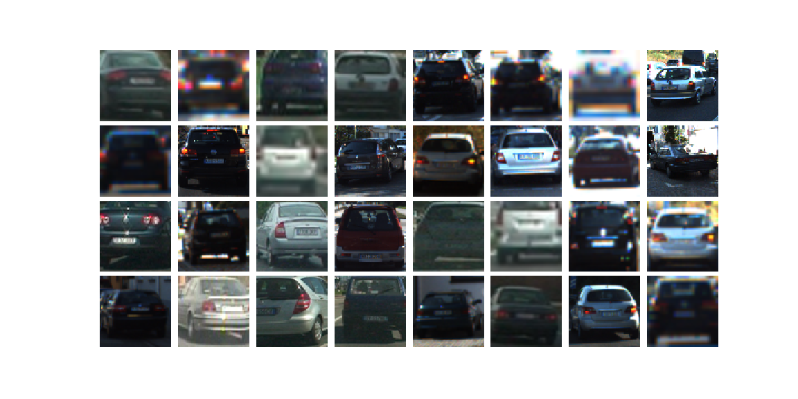
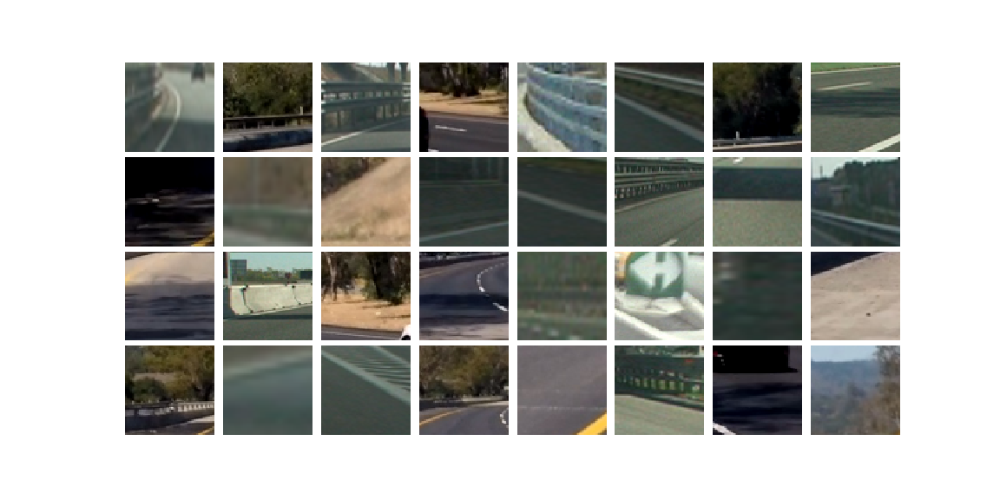
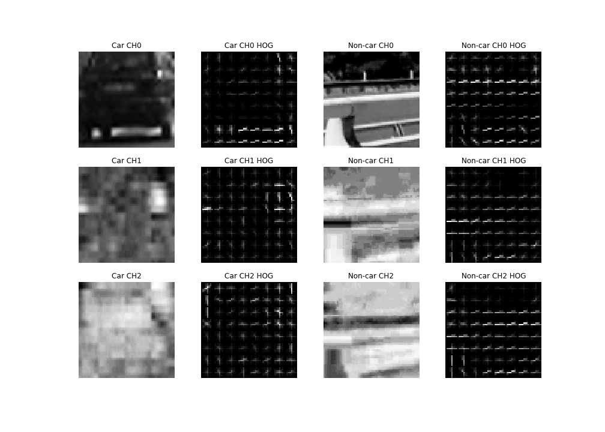
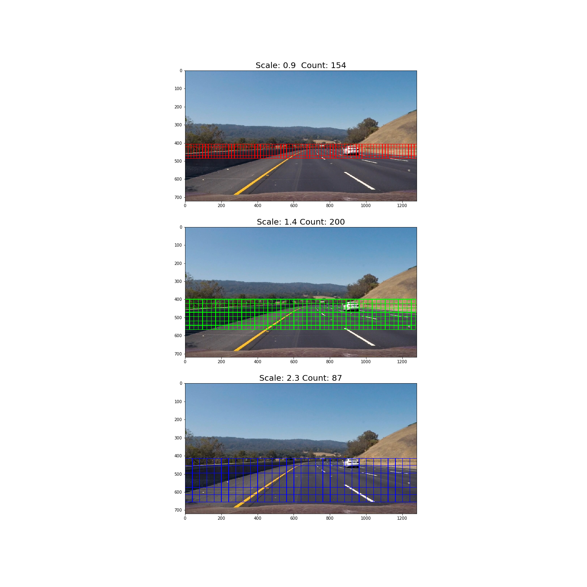
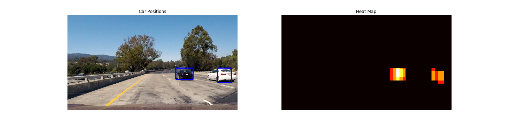

# Vehicle Detection

The Project
---

The goals / steps of this project are the following:

* Perform a Histogram of Oriented Gradients (HOG) feature extraction on a labeled training set of images and train a classifier Linear SVM classifier
* Optionally, you can also apply a color transform and append binned color features, as well as histograms of color, to your HOG feature vector.
* Note: for those first two steps don't forget to normalize your features and randomize a selection for training and testing.
* Implement a sliding-window technique and use your trained classifier to search for vehicles in images.
* Run your pipeline on a video stream (start with the test_video.mp4 and later implement on full project_video.mp4) and create a heat map of recurring detections frame by frame to reject outliers and follow detected vehicles.
* Estimate a bounding box for vehicles detected.

## Project Video

[image1]: ./output_images/thumbnail.png "Video Thumbnail"
[![Vehicle Detection][image1]](https://youtu.be/j0dS0K0BubU "Vehicle Detection Video")

## Dataset information

Number of car images: 8792

Number of non-car images: 8968

Image shape: (64, 64, 3)

## Dataset Car Image Examples

## Dataset Non-car Image examples

## Feature Extraction Functions

bin_spatial() computes bommed cp;pir featires by scaling images down

color_hist() computes colour histogram features

get_hog_features() returns HOG features and visualisation

extract_features() wraps and combines the above Functions

## HOG Visualisation

YCrCb color channels resulted in the highest accuracy in the classifier

## SVM classifier

However it seems that the reasoning behind choosing the HOG parameters is partly missing. It is written the YCrCb gave the best accuracy. What other color space were tried and what was the difference in the accuracies? And how did you choose the values for the other HOG-parameters (orient, pix_per_cell, cell_per_block)?

* The number of "orient" is specified as an integer, and represents the number of orientation bins that the gradient information will be split up into in the histogram.
* The "pixels_per_cell" parameter specifies the cell size over which each gradient histogram is computed.
* The "cells_per_block" parameter is also passed as a 2-tuple, and specifies the local area over which the histogram counts in a given cell will be normalized.

|Configuration|Colorspace|Orientations|Pixels Per Cell|Cells Per Block|HOG Channel|Classifier|Accuracy|
| - | - | - | - | - | - | - | - |
| 1 | RGB | 9 | 8 | 2 | ALL | Linear SVC | 97.92% |
| 2 | HSV | 9 | 8 | 2 | ALL | Linear SVC | 99.01% |
| 3 | LUV | 9 | 8 | 2 | ALL | Linear SVC | 98.56% |
| 4 | HLS | 9 | 8 | 2 | ALL | Linear SVC | 99.00% |
| 5 | YUV | 9 | 8 | 2 | ALL | Linear SVC | 98.59% |
| 6 | YCrCb | 9 | 8 | 2 | ALL | Linear SVC | 99.01% |

HSV and YCrCb have the best accuracy of 99.01%.

YCrCb is used for final implementation.

## Sliding Window Search

Why did you choose three window sizes?
* The three window sizes cover 3 different part of the drivable road path.
* When the vehicles was far away from the camera, it would appear small size in the image. When the vehicles was closed to the camera, it would appear large size in the image.

How did you choose the exact sizes?
* The final implementation scale are for small (0.9), medium (1.4) and large (2.3).
* The three windows size manage to detect most of the vehicles within the drivable road path.
* The final exact sizes was obtained through try and error method

What overlap ratio did you use? How did you choose that ratio?
* pix_per_cell = 8
* cells_per_step = 2
* This means that it would result in a search window overlap of 75%

The image shown the search area of the sliding window with 3 different search areas.

## Heatmapping

The outputs of the heatmap are saved and added to a queue of length n in detect_history()

By using this queue, it able to smooth the bounding boxes between frames. This step helps reduce false positives that would be mis-classified over consecutive frames.

## Conclusion

The image processing pipeline is not efficient. It took quite a while to process the video. A better method is required to process the image on real-time.

## Discussion
* I did not make any changes to the nature of the dataset. In order to improve robustness and account for varying conditions, further data augmentation would help.
* Feature such as indicate the direction of the moving car
* Using DNN or CNN such as YOLO or R-CNN, which is fast and relatively accurate.
