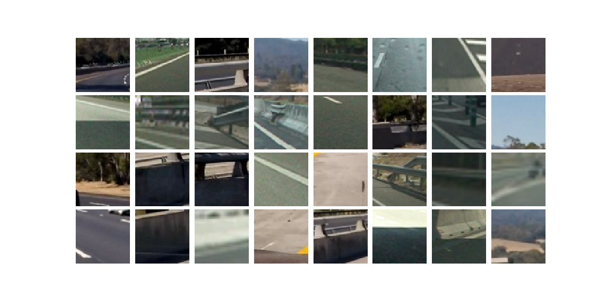
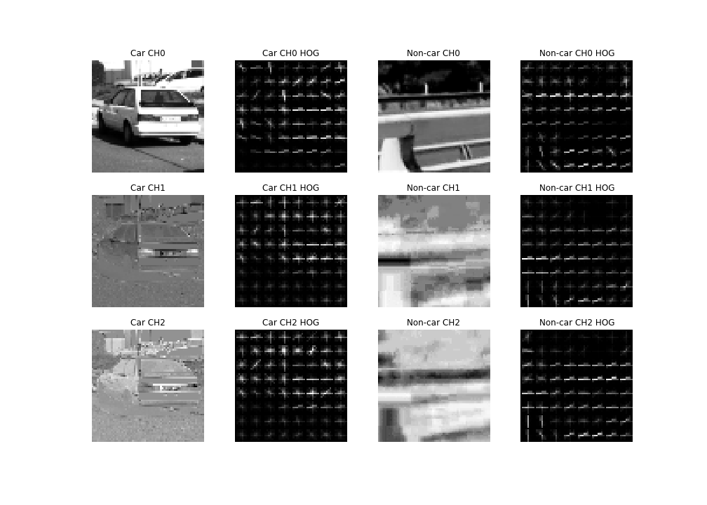

# Vehicle Detection

The Project
---

The goals / steps of this project are the following:

* Perform a Histogram of Oriented Gradients (HOG) feature extraction on a labeled training set of images and train a classifier Linear SVM classifier
* Optionally, you can also apply a color transform and append binned color features, as well as histograms of color, to your HOG feature vector.
* Note: for those first two steps don't forget to normalize your features and randomize a selection for training and testing.
* Implement a sliding-window technique and use your trained classifier to search for vehicles in images.
* Run your pipeline on a video stream (start with the test_video.mp4 and later implement on full project_video.mp4) and create a heat map of recurring detections frame by frame to reject outliers and follow detected vehicles.
* Estimate a bounding box for vehicles detected.

## Project Video

## Dataset information

Number of car images: 8792

Number of non-car images: 8968

Image shape: (64, 64, 3)

## Dataset Car Image Examples

## Dataset Non-car Image examples

## Feature Extraction Functions

bin_spatial() computes bommed cp;pir featires by scaling images down

color_hist() computes colour histogram features

get_hog_features() returns HOG features and visualisation

extract_features() wraps and combines the above Functions

## HOG Visualisation

YCrCb color channels resulted in the highest accuracy in the classifier

## SVM classifier

The SVM classifier on the dataset with a 0.987 accuracy.

## Sliding Window Search

The image shown the search area of the sliding window with 3 different search areas.

## Heatmapping

The outputs of the heatmap are saved and added to a queue of length n in detect_history()

By using this queue, it able to smooth the bounding boxes between frames. This step helps reduce false positives that would be mis-classified over consecutive frames.

## Conclusion

The image processing pipeline is not efficient. It took quite a while to process the video. A better method is required to process the image on real-time.
